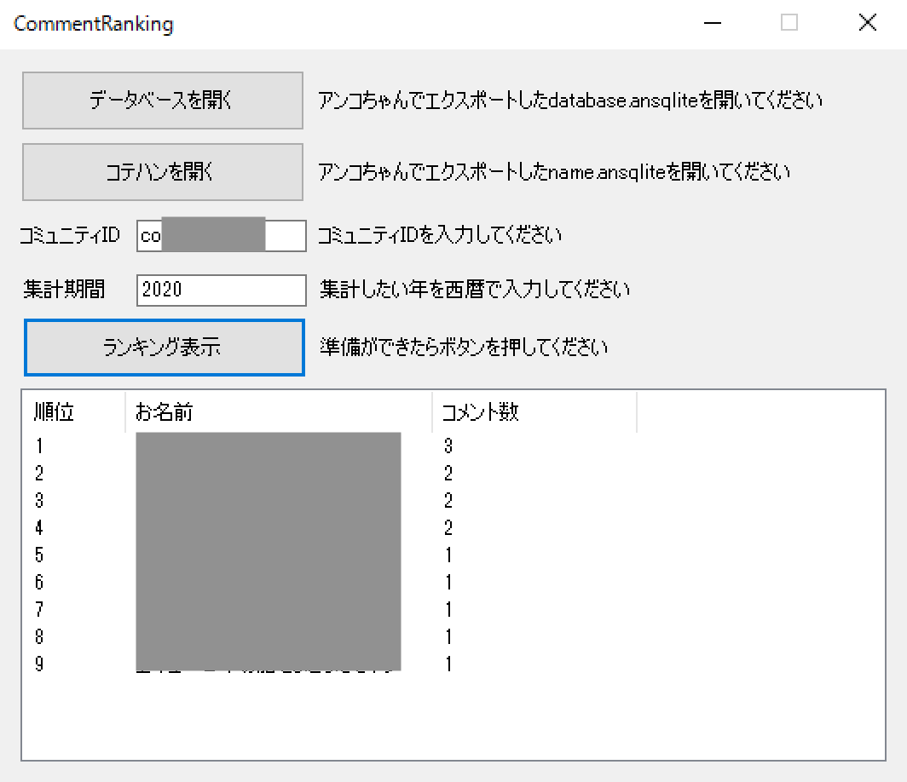

# CommentRanking
アンコちゃんのデータベースからコメント数ランキングを作成します。

## 動作環境
- .Net Framework 4.5以降（Windows 8以降）
- やります！アンコちゃんバージョン2.1.0以降のデータベースに対応。2.3.0.9でテスト済み。

## 仕様
- コテハンがついているユーザーはコテハンで表示されます
- コテハンがついていないユーザーはプロフィールの名前が表示されます
- 184は集計されません
- 集計対象期間は西暦で指定した年の1月1日0時から1年間です。

## インストール
こちらからzipファイルをダウンロードして解凍し、CommentRanking.exeを起動します。

https://github.com/leo-typeb/CommentRanking/releases/download/v1.1/CommentRanking.zip

## 使い方

### 前準備
1. やります！アンコちゃんを起動し、[ファイル]->[データ管理]を選択してデータベース管理ウインドウを開きます。
1. データベース管理ウインドウで[ファイル]->[エクスポート]を選択してdatabase.ansqliteを保存します。
1. データベース管理ウインドウで[ファイル]->[コテハンエクスポート]を選択してname.ansqliteを保存します。

### ランキングの作成
1. CommentRankingを起動します。
1. 「データベースを開く」ボタンをクリックして、エクスポートしたdatabase.ansqliteを開きます。
1. 「コテハンを開く」ボタンをクリックして、エクスポートしたname.ansqliteを開きます。
1. コミュニティID（coXXXXXX）を半角英数で入力します。
1. 集計期間に4桁の西暦を半角数字で入力します。
1. 準備ができたら「ランキング表示」ボタンをクリックします。

## 注意事項
- アンコちゃんのデータベースの破損を防止するため、必ずエクスポートしたデータベースを読み込んでください。
